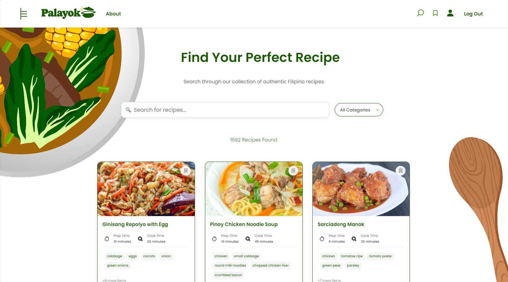
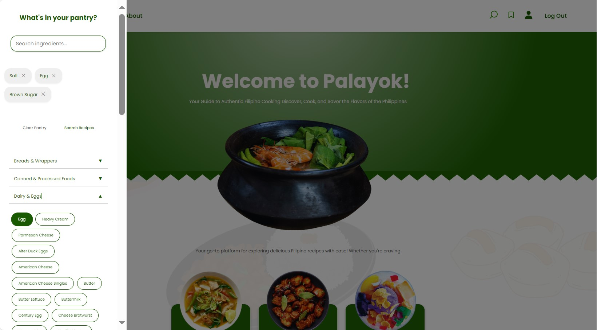

# PalayokApp

**Palayok** is a web-based application designed to help users discover, save, and enjoy Filipino recipes. Derived from the Filipino word "palayok," which refers to a traditional clay pot, the app serves as a digital vessel for Filipino culinary heritage. It features a curated collection of traditional and modern Filipino recipes scraped from *Panlasang Pinoy*, a well-known Filipino food website by Vanjo Merano.

## Created by:
- **Del Rosario, Jimalyn**  (UI/UX, Fullstack)
    - Scraped, cleaned, and organized 1500+ recipe data from Panlasang Pinoy website
    - Created filtering mechanisms for ingredient-based recipe search, recipe name search, and dietary category search
    - Created recipe saving and viewing functionalities
    - Built the pantry toggle feature for ingredient-based recipe search
    - Built the user authentication system with firebase (sign up, log in, log out features only incorporated for in deployment version) 
    - Built the user saved recipe functionalities with firestore (firestore db only incorporated in the deployment version)
    - Designed web pages background, and final styles for recipe search page, recipe view page, and about page

- **Marcos, Carl Ernard**  (UI/UX, Frontend)
    - Built the structure for the home page, recipe search page, and recipe view page
    - Designed the home page, recipe search page, and recipe view page

- **Maravilla, Ernest Matthew** (UI/UX)
    - Created app logo and color scheme
    - Helped clean up recipe data

- **Bukas, Manuelle Alexie**  (UI/UX)
    - Built structure for navigation bar and about page

**From:** BS Computer Science, PUP 3-5  

This web application serves as the final requirement for the App Development course.  

---

### Key Features:
- **Pantry Toggle:**  A side panel lets users filter recipes based on selected ingredients.

- **Recipe Discovery:** Users can explore a wide range of Filipino recipes with details such as ingredients, preparation instructions, and cooking times. It has a search bar for recipe name search and a dropdown for dietary category search.

- **Recipe Details:** Each recipe page includes a list of ingredients, preparation instructions, and cooking times. Users can also view the recipe's nutritional information.

- **Personalized Experience:** Users can create accounts to save and access their favorite recipes anytime. The app allows ingredient-based recipe filtering.

- **Bookmarking:** Users can save recipes for future reference.

